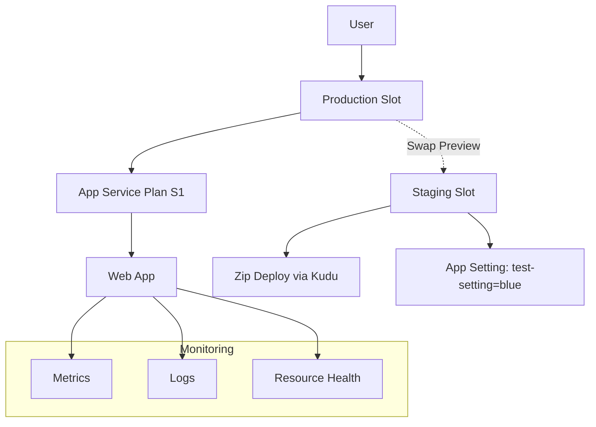

#  Azure App Service Web App Deployment & Monitoring Lab

This hands-on lab demonstrates the complete lifecycle of deploying, staging, swapping, and monitoring an Azure App Service Web App using the Azure Portal. The project covers essential real-world practices such as deployment slot management, environment configuration, zip-based deployment, and application diagnostics

 # Key Learning Objectives
 
* Understand how Azure App Service works and the different plan tiers

* Create and configure an App Service Plan (S1 Tier, Windows OS)

* Deploy a production-ready Web App using zip push deployment

* Configure staging and production slots for seamless updates and rollback

* Swap slots with preview and manage slot-specific settings

* Enable application logging and monitor with Azure built-in tools

* Use Kudu for advanced app deployment and diagnostics

---

| Task                | Details                                                 |
| ------------------- | ------------------------------------------------------- |
| ✅ App Service Plan  | `ca-lab-plan` created in **West US**, S1 tier           |
| ✅ Web App           | Windows-based, .NET 8.x Runtime                         |
| ✅ Deployment Slots  | `staging` slot created                                  |
| ✅ Zip Deployment    | Pre-built app deployed using **Kudu**                   |
| ✅ Swap with Preview | Staging → Production with test-setting confirmation     |
| ✅ Logging           | Verbose App + Web Server logging enabled                |
| ✅ Monitoring        | Metrics tracked: Connections, Thread Count, 2xx, Errors |
| ✅ Health Check      | Verified with Azure Resource Health                     |

---

## 🧱 Architecture Diagram

---

## 📁 Folder Structure

